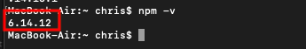

#  Human-Api-Integration 

* A job interview assignment completed in < 40 hours
* It required Integrating with Human API’s external API
* Graphed vitals fetched from their Clinical API
* Structured lifetime health data of user in a timeline view fetch from their Reports API
* Use these Login credentials to view live demo:
  * username: chris
  * email: chrisdetmering@gmail.com
  * View it live [here](https://human-api-integration.herokuapp.com/).


# Setup Instructions + Screenshots

The following are detailed instructions on how to set this project up locally. 

### Assumptions

* These instructions assume a beginner to development
* This setup is for a MacBook Pro with macOS High Sierra version 10.13.6.
* The reader has basic terminal navigation skills (how to navigate around files by using cd, for example).

### Stack 
* [React.js](https://reactjs.org/)
* [Node.js](https://nodejs.org/en/)
* [ExpressJS](https://expressjs.com/)
* [Semantic-Ui-React](https://react.semantic-ui.com/)
* [PostgreSQL](https://www.postgresql.org/)
* [HumanAPI](https://reference.humanapi.co/docs)

## Installation Steps

Overview

* [Installing Visual Studio Code (VSC)](#installing-visual-studio-code)
* [Installing Node & npm](#installing-node-and-npm)
* [Git](#git)
* [Cloning the Repo](#cloning-the-repo)
* [Opening Project in VSC](#opening-project-in-vsc)
* [Sample_env File](#sample_env-file)
* [Downloading PostgreSQL](#downloading-postgresql)
* [Create .env File](#create-dotenv-file)
* [Backup SQL](#backup-sql)
* [Installing Dependencies and Running Project](#installing-dependencies-and-running-project)
* [Screenshots of App](#screenshots-of-app)


## Installing Visual Studio Code
We are going to start this setup by making sure we have an IDE or text editor. 
We are going to use [Visual Studio Code](https://code.visualstudio.com/). Click on the [link provided](https://code.visualstudio.com/) and follow the instructions. 

## Installing Node and npm 
Next, let's make sure we have Node.js and npm installed. To check for this, navigate to your terminal and type: 

```
node -v
```

And 

```
npm -v
```

If you have node installed, you should see a node version pop up in your 
terminal: 


If you do not have Node.js. Then navigate to [Node's website](https://nodejs.org/en/) and 
download the latest stable version (LTS). 


And then run:

```
node -v
```

You should see a Node version show up (version will be different):


If you do not have npm installed, then run: 

```
npm install -g npm
```

!!!WARNING!!! 


You might get the following error after running the command above:


If you get this, then try:

```
sudo npm install -g npm
```

If you do this, you will be prompted to enter in your password that you used to 
sign into your Mac. 

As with Node, check if the intallation was successful by running:

```
npm -v
```

You should see the following show up in our terminal but with a newer version number: 



## Git

Let's make sure we have git. Type in your terminal: 

```
git --version
```

If you are on a Mac then you will most likely get a pop up that looks like this: 


If that is the case, then click on install. As we have done previously, let's make sure 
that the installation worked by running: 

```
git --version
```

## Cloning the Repo

Now that we have git installed, it's time to clone down the repo. Go 
to the [projects repo](https://github.com/chrisdetmering/Human-API-Integration) and click the Code button and then the 
copy to keyboard button: 


Now, open up a terminal window and cd into the directory that you want to clone 
the repo in to. You will then type in the terminal: 

```
git clone https://github.com/chrisdetmering/Human-API-Integration.git
```


## Opening Project in VSC

In a new Visual Studio Code instance, click the Open button: 


The file navigation will open up, select the folder you saved the cloned repo to. By default, it should be named Human-API-Integration. Then click Open: 


## Sample_env File

The project file structure should look like this: 


Click on the sample_env file:


Inside of this file, we have a schema for creating our .env file. An .env file is where we keep or environment variables for the project that we don’t want to make public, 
like secret API keys or Database passwords: 


We are going to set each of the variables in your sample_env and the copy the contents to a .env file.

We are going to take each one of environment variables step by step. 
```
CLIENT_ID & CLIENT_SECRET 
```
You get these two varibles by contacting contact@humanapi.co to set up an active contract. 

```
TOKEN_AUTH_ENDPOINT 
```
According to the [Human API docs](https://reference.humanapi.co/docs/start-a-user-session) this will be 
https://auth.humanapi.co/v1/connect/token

```
SESSION_SECRET
```
This can be any random string that the app uses as the secret for the session. 


## Downloading PostgreSQL

For the next four environment variables, we are going to need PostgreSQL installed. 
To do this (and to download the other tools you are going to need) go to this [link](https://www.postgresql.org/download/macosx/) and click Download the installer: 


This will take you through an installer that will download psql, a CLI for interacting with PostgreSQL & pgAdmin a GUI for interacting with postgreSQL. Take note of the password that you are prompted to make in the setup wizard. You will need to keep that for our environment variables. 

After the wizard has completed, go to your Applications and look for a folder with the name of PostgreSQL 14: 


Click on the PostgreSQL 14 folder and inside you will see the following: 


Click on pgAdmin 4. You will be prompted to make up a master password. Save this because you will need it every time you reopen pgAdmin:


Next, click on servers and you should see PostgreSQL listed. Additionally, there will be a pop up that will ask you for the password that we saved earlier for postgreSQL in the setup wizard. 


With this, we can fill in 3/4 remaining environment variables. 


```
DB_PASSWORD=password 
```
This will be set to the password you just entered. So in my case, my password was ‘password’. 


```
DB_HOST=localhost
```
!!!WARNING!!! 

Use localhost instead of 5432 because this might make you run into an error while interacting with the session. 

```
DB_USER=postgres 
```

This is the default user for postgreSQL. If you set it to something else, insert that here.

We just need one more environment variable and that is 

```
DB_DATABASE
```

We do not have this yet because we have not created it. We will do that now. 

Click on the PostgreSQL 14 server you will see some options:


Right click on Databases and a tooltip will pop open. There will be an option to create a database:


Click on Create > Database and pick a name for the DB. For example, human_api:


Click the Save button and then your DB will be created. 

Now we can fill in our last environment variable: 

```
DB_DATABASE=human_api
```

Let’s make our .env file now that we have all the environment variables filled in.


## Create Dotenv File

In order to do this, you can select to create a new file in Visual Studio Code 


And name it .env. 

We are going to copy and paste all the variables we have filled in so far. Your file should now look like this: 


Note that CLIENT_ID & CLIENT_SECRET are not filled in. You will need to get this from HumanAPI directly. 
Additionally, note that I just typed in a random string for the SESSION_SECRET. 
You can generate this however you want. 
Lastly, all the DB information is what we filled in, in the last couple of steps. 
If you did not choose the default name postgres as your database user, then the DB_USER environment variable should reflect that. 

## Backup SQL

We are almost there! 

We have a couple more things we need to do: create our database tables and install our dependencies using npm!

To create our database tables, you are going to select the database folder: 


And copy the contents of the backup.sql file 


You will then navigate to pgAdmin and open the query tool by clicking on the human_api database and selecting the query tool option:


This will pull up an interface that will allow you to paste in the SQL code you copied from the backup.sql file. 

Click the arrow button after you have pasted in all the SQL code: 


This will run your SQL query. Any errors that happen during the running of these sql scripts you will see below. 
Otherwise you will see “Query returned successfully in x msec”.


Aftering doing this, you should be able to navigate to your human_api database click on the Tables sections and see your newly created tables:


## Installing Dependencies and Running Project

Last step! 

We are going to run 
```
npm i 
```
In our root directory 

And then we will cd into the client directory and run 
```
npm i 
```
As well. 

We are doing this to download all the dependencies that our project needs. 

Lastly, 

Navigate back to the root directory and run 
```
npm run dev 
```
Then go to 

Localhost:3000 and you should see the project hosted! 

## Screenshots of App

### Login 


### Connect Page 


### Open Connect Page 


### Connect Lifecycle Hook on Close Summary 


### Clinical API


### Reports API


