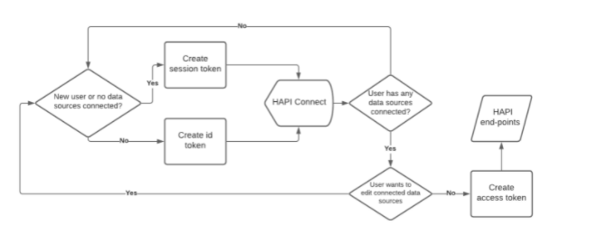

# What would you change about Human API’s product? 

There are two things I would change: the documentation and the authorization flow. 

## Documentation 

I think there are some things that would make it easier for a new developer looking at documentation! 

First. It would be helpful if the documentation were more visual. For example, some more code samples of what it would look like to integrate with the api. 

Second: more linear. The dependencies were a little confusing and the documentation would jump around a bit. It did make more sense after reading it over and building this application with it. However, it did seem like the docs would jump ahead or behind a little too much leading to some confusion of where the starting point was. Though it was clear you needed the client_id and the client_secret.

I think a possible solution to this would be a step by step guide using a project that the developer can download from git. This project would include a starting template and the finished product, as well as any in-between steps. They can follow along and learn how to integrate it with the project. 

## Authorization flow

This goes hand in hand with the documentation. It was hard to parse out what exactly needed to happen and when with a new user before and after connecting a resource and for a returning user. How to handle these cases when you have your own list of users. What would be best practice? Again, I think a fully flushed out example project with a DB would be a good solution to this. 

# Where were the primary points of friction during integration?

My primary points of friction came from the same source: Understanding the Authorization flow. I think the diagram provided was a little confusing initially: 

I think a more linear diagram would have helped me understand your authorzation pattern. So if the diagram was something like: 

New user > create session_token > HAPI Connected > connect source > etc.

Existing user > create id_token  + access_token  

Two different paths moving from A -> B -> C -> etc. 

This confusion made it hard to know how to implement generating a session_token vs a id_token depending on the user’s connection status. All this being said, after implementing the flow, the diagram makes much more sense. Again, maybe having a sample project would help this :).  
